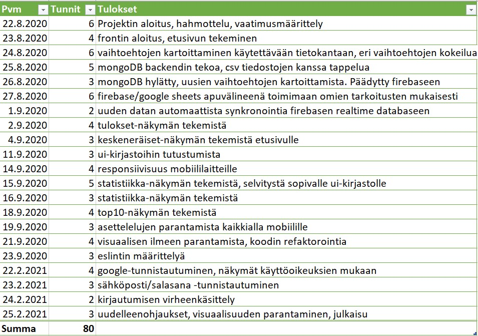

## Vetoseuranta

Single-page application used for tracking sports betting results. Uses the Firebase Realtime Database for fetching data and requires login to see content. Test user credentials are prefilled to login and see example data.

https://vetokone-e63f4.firebaseapp.com/

## Technologies

- React
- Firebase
- Redux
- Material-UI

## How to use

App has been created using create-react-app.
To clone and run this application, you'll need Git and Node.js (which comes with npm) installed on your computer. From your command line:

```
# Clone this repository
$ git clone https://github.com/rikkerikardo/vetoseuranta

# Go into the repository
$ cd vetoseuranta

# Install dependencies
$ npm install

# Run the app (developement build)
$ npm start

# For production build
$ npm run build
```

For fetching your own data from Firebase Realtime Database, you need to create config.js, which App.js uses to get access to Realtime Database. Instructions for configurations and creating your own Realtime Database can be found here https://firebase.google.com/docs/database/web/start

This app doesn't take a stand for how the data is pushed to Realtime Database, it only makes possible for fetching data from it.

## Used hours for project/school assignment


